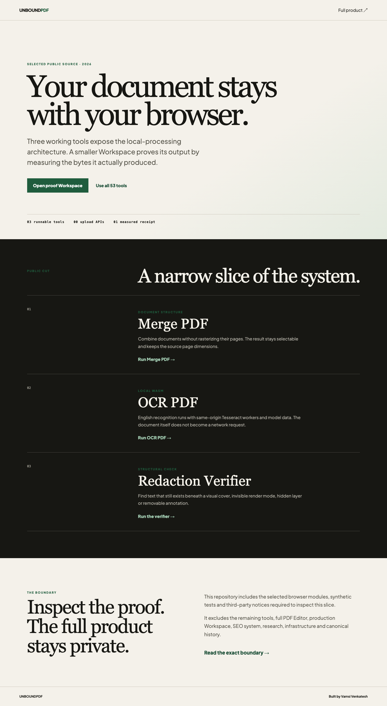

# UnboundPDF — selected public source

**Private documents. Real browser tools. Nothing uploaded.**

[Use the full product](https://unboundpdf.com/) · [Open the Workspace](https://unboundpdf.com/workspace/) · [Read the privacy model](docs/PRIVACY.md)

UnboundPDF is a free browser-based document suite. The production product currently offers 53 PDF and image tools. Files are processed locally in the browser; the tool runtime has no document-upload API.



This repository publishes three representative, runnable tools and a deliberately smaller Workspace demonstration:

| Public component | What it demonstrates |
| --- | --- |
| [Merge PDF](tools/merge-pdf/) | Deterministic multi-document processing with original page quality preserved |
| [OCR PDF](tools/ocr-pdf/) | Same-origin WebAssembly OCR with English language data stored beside the application |
| [Redaction Verifier](tools/redaction-verifier/) | Structural detection of text that remains beneath visual covers, invisible rendering modes, hidden layers or annotations |
| [Workspace proof demo](workspace/) | A small merge chain that measures the output and records its SHA-256 instead of asserting success |

The complete production implementation, full tool catalogue, PDF editor, growth system, build generators and operating infrastructure remain private. See [PUBLIC-BOUNDARY.md](PUBLIC-BOUNDARY.md).

## Run locally

```bash
python3 -m http.server 4173
```

Then open <http://127.0.0.1:4173/>. The repository contains no server-side document processor. A local static server is used because browser workers and WebAssembly require HTTP rather than `file://` URLs.

## Verify

```bash
npm test
npm run audit:public
```

The tests inspect the selected product surface, exercise the Workspace merge path, verify a redaction-detection corpus, confirm same-origin OCR assets, scan the public tree for forbidden private material, and reject files outside the declared boundary.

## Scope and claims

- The public OCR edition includes English recognition data. The live product has a broader language catalogue.
- Redaction Verifier detects text that is still present. It cannot prove that a redaction occurred or identify content that was successfully removed.
- Local processing protects document contents from an upload service. It does not make an untrusted document harmless or secure the user's device.
- Performance depends on the browser, device and document structure.

See [CLAIMS.md](docs/CLAIMS.md), [LIMITATIONS.md](docs/LIMITATIONS.md) and the machine-readable [proof manifest](proof/manifest.json).

## Ownership and licences

First-party UnboundPDF source in this repository is published for inspection. No open-source licence is granted for first-party code. GitHub's public-repository terms still permit viewing and forking through GitHub's service.

Vendored third-party components remain under their own licences. Their notices and source references are preserved in [THIRD_PARTY_NOTICES.md](THIRD_PARTY_NOTICES.md) and [third-party-manifest.json](docs/third-party-manifest.json).

Copyright © 2026 Vamsi Venkatesh. All rights reserved for first-party material.
